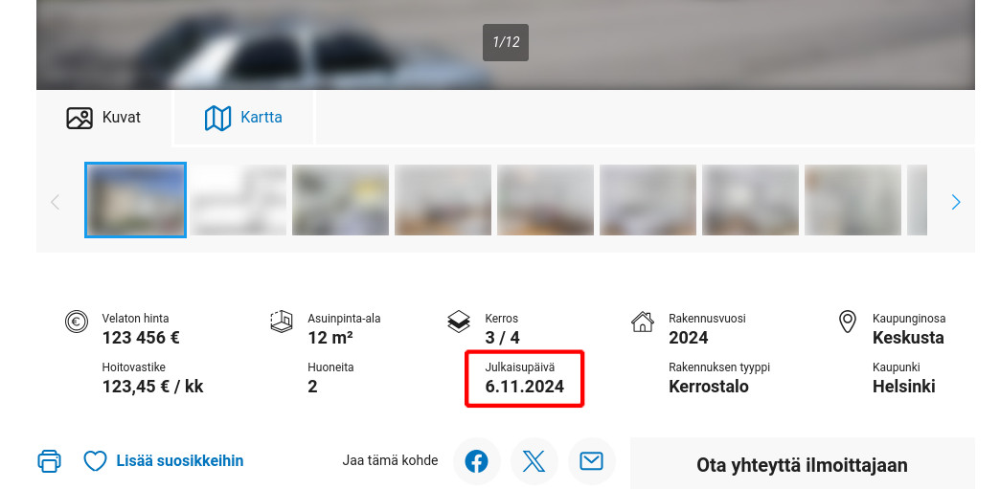

# Oikotie Published Date

This userscipt adds the published date to the Oikotie.fi housing ads.

## Installation

To install the userscript, you need to have a userscript manager installed in your browser. For example, you can use Violentmonkey: https://violentmonkey.github.io/